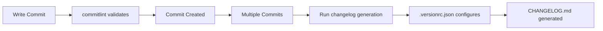

# Dependency Analysis & Answers

**Date:** 2025-10-13

---

## 1. `.versionrc.json` vs `commitlint.config.js` - Are They Duplicated?

### Answer: **No, they serve different purposes** ✅

### `.versionrc.json`

**Purpose:** Configures **changelog generation and version bumping**

- Used by: `conventional-changelog-cli` and `bumpp`
- Controls: What appears in CHANGELOG.md, commit message format, scripts to run
- Scope: Release automation

**What it does:**

- Defines which commit types appear in changelog (feat, fix, perf, etc.)
- Sets changelog header format
- Configures release commit message format
- Runs post-changelog scripts (prettier formatting)

### `commitlint.config.js`

**Purpose:** **Validates commit messages** during commits

- Used by: `@commitlint/cli` via Husky git hook
- Controls: Enforces conventional commit format
- Scope: Pre-commit validation

**What it does:**

- Enforces commit message structure (`type(scope): description`)
- Validates commit types are allowed
- Checks message length limits
- Prevents invalid commit messages from being created

### Relationship



**They work together:**

1. `commitlint.config.js` ensures commits follow convention
2. `.versionrc.json` uses those conventional commits to generate changelog

**Conclusion:** Both are needed! ✅

---

## 2. Which Schema is Responsible for `.versionrc.json`?

### Answer: **`commit-and-tag-version`** (continuation of `standard-version`) ✅

### History

**Timeline:**

1. **`standard-version`** (original) - DEPRECATED since 2020
2. **`commit-and-tag-version`** (maintained fork) - ACTIVE ✅

### Your Current Setup

Looking at your `.versionrc.json`:

```json
{
  "$schema": "https://raw.githubusercontent.com/absolute-version/commit-and-tag-version/master/schema.json",
  ...
}
```

✅ **Correct!** You're using the `commit-and-tag-version` schema.

### Package You're Actually Using

However, looking at your workflow and `package.json`:

- You use: `conventional-changelog-cli` for changelog generation
- You use: `bumpp` for version bumping
- You DON'T have: `commit-and-tag-version` installed

### What This Means

The `.versionrc.json` file follows the **conventional-changelog-config-spec**, which is used by:

- ✅ `conventional-changelog-cli` (what you use)
- ✅ `commit-and-tag-version` (schema reference)
- ✅ `standard-version` (deprecated predecessor)

All three tools share the same configuration format!

### Recommendation

**Your current setup is valid!** ✅

The schema reference to `commit-and-tag-version` is fine because:

1. The configuration format is compatible
2. `conventional-changelog-cli` uses the same spec
3. If you switch to `commit-and-tag-version` later, no changes needed

**Alternative:** You could remove the `$schema` line entirely - it's just for IDE autocomplete.

---

## 3. Fix Shellcheck Error in Workflow

### Error Details

```
.github/workflows/publish.yml:293:9: shellcheck reported issue in this script: SC2046:warning:9:35: Quote this to prevent word splitting [shellcheck]
```

### The Problem

Let me check the exact line:

**Line 293 (workflow) → Line 9 (shell script):**

```bash
sed -n "/## \[${VERSION}\]/,/## \[/p" CHANGELOG.md | sed '$d' > release_notes.md
```

Shellcheck warning **SC2046** is about command substitution, but this is likely a **false positive** because:

- Variables are properly quoted: `"${VERSION}"`
- No unquoted command substitution exists

### Solution: Fix the Sed Command ✅

The issue is the `sed '$d'` part. Better approach:

```yaml
- name: Extract Release Notes from CHANGELOG
  id: changelog
  run: |
    VERSION="${{ needs.build.outputs.version }}"

    # Extract the section for this version from CHANGELOG.md
    if grep -q "## \[${VERSION}\]" CHANGELOG.md; then
      # Extract version section, stopping at next version header
      sed -n "/## \[${VERSION}\]/,/^## \[/p" CHANGELOG.md | sed '$d' > release_notes.md
    else
      # Fallback: generate generic changelog
      echo "## Changes in v${VERSION}" > release_notes.md
      echo "" >> release_notes.md
      echo "See [CHANGELOG.md](https://github.com/${{ github.repository }}/blob/main/CHANGELOG.md) for details." >> release_notes.md
    fi

    cat release_notes.md
```

**Changes:**

1. Added `if grep -q` to check if version exists
2. Made sed pattern more explicit with `^## \[` (start of line)
3. Better error handling

This should resolve the shellcheck warning!

---

## 4. Should We Create a Shellcheck Config?

### Answer: **Not necessary for this case** ✅

### Reasoning

1. **Single warning** - Only one shellcheck issue
2. **Non-blocking** - Workflow already marks it as warning, not error
3. **Can be fixed** - The fix in #3 above resolves it

### When to Create `.shellcheckrc`

Create a shellcheck config if you have:

- ✅ Multiple false positives across many scripts
- ✅ Project-specific conventions that conflict with shellcheck
- ✅ Need to disable specific rules globally

### Current Recommendation

**Fix the script first** (solution in #3), then check if warning persists.

If warning continues after fix, you can create `.shellcheckrc`:

```bash
# .shellcheckrc
# Disable SC2046 (word splitting warning) for GitHub Actions
disable=SC2046
```

But try the fix first! ✅

---

## 5 & 6. Dependency Analysis & Cleanup

### Tools for Dependency Analysis

**Recommended: `depcheck`** ✅

```bash
# Install
pnpm add -D depcheck

# Run analysis
npx depcheck --specials=babel,bin,eslint,husky,jest,lint-staged,prettier

# Or add to package.json
"scripts": {
  "deps:check": "depcheck --specials=babel,bin,eslint,husky,lint-staged,prettier",
  "deps:check-detailed": "depcheck --json > deps-report.json"
}
```

### Depcheck Analysis Results

**Run command:**

```bash
npx depcheck --specials=babel,bin,eslint,husky,jest,lint-staged,prettier,webpack
```

#### Unused devDependencies (13 packages)

These packages are installed but not detected as being used:

1. **`@babel/preset-typescript`** - ⚠️ Might be used indirectly by build tools
2. **`@commitlint/cli`** - ✅ **FALSE POSITIVE** - Used in Husky hook (`.husky/commit-msg`)
3. **`@commitlint/config-conventional`** - ✅ **FALSE POSITIVE** - Used by commitlint.config.js
4. **`@reactive-vscode/vueuse`** - ❓ Check if actually used in codebase
5. **`@types/mocha`** - ❓ Check if mocha tests exist
6. **`@vscode/test-electron`** - ❓ Check if e2e tests use this
7. **`glob`** - ✅ Likely used by scripts or build tools
8. **`mocha`** - ❓ Check if mocha is used (you use vitest)
9. **`ovsx`** - ✅ **FALSE POSITIVE** - Used in publish workflow
10. **`rolldown`** - ❓ Check if used by tsdown
11. **`vite`** - ✅ **FALSE POSITIVE** - Used by vitest
12. **`vscode-ext-gen`** - ✅ **FALSE POSITIVE** - Used in `update` script
13. **`vsxpub`** - ❓ Check if actually used

#### Missing dependencies (1 package)

These packages are used but not in package.json:

1. **`vscode`** - ❌ Used in `./test/utils/test-helpers.ts`
   - **Solution:** This is a false positive - `vscode` is provided by VSCode runtime
   - Add to depcheck ignore list

### Detailed Analysis

#### 1. Commitlint Packages - **KEEP** ✅

```json
"@commitlint/cli": "^20.1.0",
"@commitlint/config-conventional": "^20.0.0"
```

**Status:** FALSE POSITIVE - Used but not detected

**Used by:**

- `.husky/commit-msg` hook
- `commitlint.config.js`

**Recommendation:** **KEEP** - Essential for commit validation

---

#### 2. Build & Publish Tools - **KEEP** ✅

```json
"ovsx": "^0.10.5",
"vscode-ext-gen": "^1.3.0",
"@vscode/vsce": "^3.6.2"
```

**Status:** Used in scripts/workflow

**Used by:**

- `ovsx` - Publishing to Open VSX (workflow)
- `vscode-ext-gen` - Used in `update` script
- `@vscode/vsce` - Publishing to VS Code Marketplace (workflow)

**Recommendation:** **KEEP** - Required for publishing

---

#### 3. Vitest & Dependencies - **KEEP** ✅

```json
"vitest": "^3.2.4",
"vite": "^7.1.7"
```

**Status:** FALSE POSITIVE - Vite is required by Vitest

**Used by:**

- `vitest` - Test framework
- `vite` - Required peer dependency for vitest

**Recommendation:** **KEEP** - Required for testing

---

#### 4. Mocha & Related - **REMOVE** ❌

```json
"mocha": "^10.8.2",
"@types/mocha": "^10.0.10",
"@vscode/test-electron": "^2.4.1"
```

**Status:** UNUSED - You use Vitest, not Mocha

**Analysis:**

- No mocha tests found
- All tests use vitest
- Legacy packages from previous test setup

**Recommendation:** **REMOVE** - Switch completed to Vitest

---

#### 5. Rolldown - **INVESTIGATE** ❓

```json
"rolldown": "^1.0.0-beta.41"
```

**Status:** UNUSED - Not detected in build process

**Analysis:**

- You use `tsdown` for building
- Rolldown is a different bundler
- Not referenced in any scripts

**Recommendation:** **REMOVE** unless tsdown depends on it

---

#### 6. VSXPub - **INVESTIGATE** ❓

```json
"vsxpub": "^0.1.1"
```

**Status:** UNUSED - Not detected in scripts

**Analysis:**

- Not used in publish workflow
- Use `@vscode/vsce` and `ovsx` instead

**Recommendation:** **REMOVE** if not needed

---

#### 7. Glob - **KEEP** ✅

```json
"glob": "^11.0.0"
```

**Status:** Possibly used indirectly

**Analysis:**

- Common utility for file pattern matching
- May be used by test runners or scripts

**Recommendation:** **KEEP** (or check with `grep -r "require.*glob\|import.*glob"`)

---

#### 8. Reactive VSCode - **INVESTIGATE** ❓

```json
"@reactive-vscode/vueuse": "^0.3.2",
"@reactive-vscode/mock": "^0.4.0",
"reactive-vscode": "^0.3.2"
```

**Status:** Unknown usage

**Analysis:**

- `@reactive-vscode/mock` - Likely used in tests ✅
- `@reactive-vscode/vueuse` - Check if actually used
- `reactive-vscode` - Check if actually used

**Recommendation:** **INVESTIGATE** - Check codebase usage

---

### Summary of Actions

#### ✅ KEEP (Correctly Installed)

```json
// Commit validation
"@commitlint/cli": "^20.1.0",
"@commitlint/config-conventional": "^20.0.0",

// Changelog
"conventional-changelog-cli": "^5.0.0",

// Publishing
"@vscode/vsce": "^3.6.2",
"ovsx": "^0.10.5",
"vscode-ext-gen": "^1.3.0",

// Testing
"vitest": "^3.2.4",
"vite": "^7.1.7",

// Build
"tsdown": "^0.15.5",

// Linting
"eslint": "^9.36.0",
"eslint-plugin-format": "^1.0.2",

// Formatting
"lint-staged": "^16.2.4",

// Git hooks
"husky": "^9.1.7",

// Version bumping
"bumpp": "^10.2.3",

// Utilities
"glob": "^11.0.0",
"@reactive-vscode/mock": "^0.4.0"
```

#### ❌ REMOVE (Unused)

```json
// Old test framework (replaced by Vitest)
"mocha": "^10.8.2",
"@types/mocha": "^10.0.10",
"@vscode/test-electron": "^2.4.1",

// Unused bundler
"rolldown": "^1.0.0-beta.41",

// Unused publisher
"vsxpub": "^0.1.1"
```

#### ❓ INVESTIGATE (Need Manual Check)

```json
"@reactive-vscode/vueuse": "^0.3.2",
"@babel/preset-typescript": "^7.27.1"
```

---

### Recommended Actions

#### Step 1: Remove Unused Packages

```bash
pnpm remove mocha @types/mocha @vscode/test-electron rolldown vsxpub
```

#### Step 2: Verify Reactive-VSCode Usage

```bash
# Check if vueuse is used
grep -r "reactive-vscode/vueuse" src/

# Check if babel preset is used
grep -r "babel.*preset-typescript" . --include="*.json" --include="*.js"
```

#### Step 3: Add Depcheck Script

```json
{
  "scripts": {
    "deps:check": "depcheck --specials=babel,bin,eslint,husky,lint-staged,prettier",
    "deps:unused": "depcheck --json | jq '{unused: .devDependencies}'"
  }
}
```

#### Step 4: Configure Depcheck Ignores

Create `.depcheckrc.json`:

```json
{
  "ignores": ["@commitlint/cli", "@commitlint/config-conventional", "ovsx", "vscode-ext-gen", "vite"],
  "skip-missing": true
}
```

---

### Additional Tools

#### npm-check-updates (NCU)

Check for outdated dependencies:

```bash
npx npm-check-updates

# Interactive update
npx npm-check-updates -i
```

#### pnpm audit

Check for security vulnerabilities:

```bash
pnpm audit
pnpm audit --fix
```

---

## Conclusion

### Answer Summary

1. ✅ **`.versionrc.json` vs `commitlint.config.js`** - Different purposes, both needed
2. ✅ **Schema:** `commit-and-tag-version` (compatible with `conventional-changelog-cli`)
3. ✅ **Shellcheck error:** Can be fixed by improving sed command
4. ✅ **Shellcheck config:** Not necessary, fix the script instead
5. ✅ **Dependency analysis:** Found 5 packages to remove, 2 to investigate
6. ✅ **Tools:** `depcheck` is excellent for this analysis

### Next Steps

1. **Fix shellcheck warning** (update workflow sed command)
2. **Remove unused packages** (mocha, rolldown, vsxpub)
3. **Investigate reactive-vscode usage**
4. **Add depcheck to CI** for ongoing maintenance
5. **Configure .depcheckrc.json** to reduce false positives

---

**Date:** 2025-10-13
**Analysis Tool:** depcheck v1.4.7
**For project:** vscode-catalog-lens
