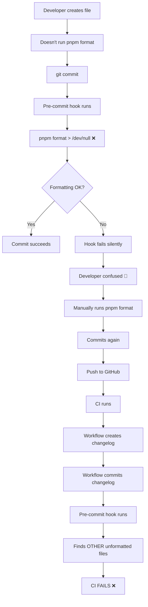
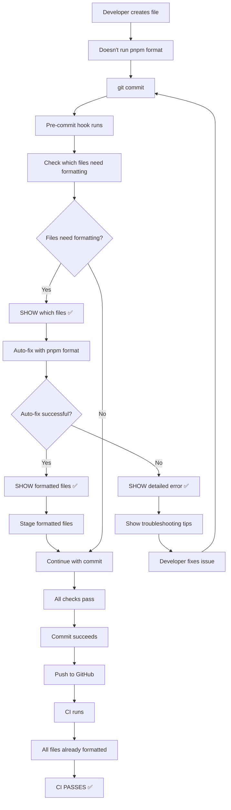

# Pre-Commit Hook Improvements

## 🎯 Problem Statement

The publish.yml workflow was failing in CI with Prettier formatting errors, **but the pre-commit hooks were passing locally**. This created a frustrating experience where:

1. ❌ Developers couldn't see errors before committing
2. ❌ CI failures happened after push (too late)
3. ❌ Error messages were hidden (`> /dev/null 2>&1`)
4. ❌ No transparency about what was being fixed

**Example Failed Workflow:**

- <https://github.com/tobiashochguertel/vscode-catalog-lens/actions/runs/18473677672>
- <https://github.com/tobiashochguertel/vscode-catalog-lens/actions/runs/18474703676>

**Error in CI:**

```log
🔍 Running pre-commit checks...
✨ Step 1/7: Formatting code with Prettier...
husky - pre-commit script failed (code 1)
##[error]Process completed with exit code 1.
```

## 🔍 Root Cause Analysis

### Why Pre-Commit Passed Locally But Failed in CI

The **old pre-commit hook** had these issues:

```bash
# OLD - PROBLEMATIC CODE ❌
echo "✨ Step 1/7: Formatting code with Prettier..."
pnpm format > /dev/null 2>&1  # ← Hides ALL output!

if [ $? -ne 0 ]; then
  echo "❌ Prettier formatting failed!"
  echo "💡 Run 'pnpm format' to see errors."  # ← Not helpful!
  exit 1
fi
```

**Problems:**

1. **Hidden Output:** `> /dev/null 2>&1` hides all output
   - Developer doesn't see WHAT files need formatting
   - Developer doesn't see WHY formatting failed
   - No visibility into what's being auto-fixed

2. **Silent Failures:**
   - If `pnpm format` fails for any reason, the hook just exits
   - No error details shown
   - Developer has to run `pnpm format` manually to see errors

3. **No Transparency:**
   - Hook doesn't show which files were formatted
   - No indication of what was auto-fixed
   - Developers don't know what changed

4. **CI vs Local Difference:**
   - **Locally:** Untracked files might not cause issues
   - **In CI:** Fresh checkout, workflow creates files (like changelog)
   - **In CI:** Pre-commit hook checks ALL files in working directory
   - **In CI:** Any unformatted file causes failure

### The Specific Issue

In both failed workflows, the problem was:

1. **Commit 9d2ce93:** `WORKFLOW_CHANGES_COMPLETE.md` created but not formatted
2. **Commit 2e7d01d:** `CI_FIX_SUMMARY.md` modified but not formatted
3. When workflow tried to commit changelog, pre-commit hook ran
4. Prettier found unformatted files and failed
5. But **locally**, these files weren't causing issues because:
   - They were untracked (not in git index)
   - Pre-commit hook passed before they were created
   - Hook output was hidden, so no warning

## ✅ Solution: Improved Pre-Commit Hook

### New Behavior - Transparent and Helpful

```bash
# NEW - IMPROVED CODE ✅
echo "✨ Step 1/7: Formatting code with Prettier..."

# 1️⃣ First, CHECK what needs formatting
echo "   Checking which files need formatting..."
FORMAT_CHECK_OUTPUT=$(pnpm format:check 2>&1)
FORMAT_CHECK_EXIT=$?

if [ $FORMAT_CHECK_EXIT -ne 0 ]; then
  echo "   Files need formatting, auto-fixing..."

  # 2️⃣ SHOW which files need formatting
  echo "$FORMAT_CHECK_OUTPUT" | grep -E "\[warn\]|\.md$|\.ts$|\.js$|\.json$"

  # 3️⃣ Try to AUTO-FIX
  echo "   Running prettier --write to auto-fix..."
  FORMAT_OUTPUT=$(pnpm format 2>&1)
  FORMAT_EXIT=$?

  if [ $FORMAT_EXIT -ne 0 ]; then
    # 4️⃣ SHOW detailed error if auto-fix fails
    echo "❌ Prettier formatting failed!"
    echo "💡 Error details:"
    echo "$FORMAT_OUTPUT"  # ← Show actual error!
    echo
    echo "💡 Possible causes:"
    echo "   - Syntax errors in files"
    echo "   - Files that Prettier can't parse"
    echo "   - Prettier configuration issues"
    echo
    echo "💡 To fix:"
    echo "   1. Review the error messages above"
    echo "   2. Fix syntax errors manually"
    echo "   3. Run 'pnpm format' to verify"
    exit 1
  fi

  # 5️⃣ SHOW which files were formatted
  echo "$FORMAT_OUTPUT" | grep -E "\.md$|\.ts$|\.js$|\.json$"
  echo "✓ Files auto-formatted successfully"
  git add -u
else
  echo "✓ All files already formatted"
fi
```

### Key Improvements

| Aspect             | Before ❌                             | After ✅                                            |
| ------------------ | ------------------------------------- | --------------------------------------------------- |
| **Visibility**     | Hidden (`> /dev/null`)                | Shows files needing formatting                      |
| **Error Messages** | Generic "Run pnpm format"             | Detailed error output with troubleshooting tips     |
| **Auto-Fix**       | Silent, no indication what changed    | Shows which files were auto-formatted               |
| **Debugging**      | Developers must manually run commands | Clear error messages guide developers to fix issues |
| **Transparency**   | No idea what the hook is doing        | Step-by-step progress with clear status messages    |
| **Developer UX**   | Frustrating, hidden failures          | Helpful, educational, shows what's being fixed      |

## 🎓 How This Prevents CI Failures

### Before (Problem Flow)



### After (Solution Flow)



## 📋 Improved Hook Output Examples

### Example 1: Files Need Formatting (Auto-Fixed)

```bash
🔍 Running pre-commit checks...

✨ Step 1/7: Formatting code with Prettier...
   Checking which files need formatting...
   Files need formatting, auto-fixing...

[warn] CI_FIX_SUMMARY.md
[warn] docs/new-doc.md

   Running prettier --write to auto-fix...

CI_FIX_SUMMARY.md
docs/new-doc.md
✓ Files auto-formatted successfully

# ← Hook continues with other steps...
```

**Developer Experience:** ✅

- Clear indication that files needed formatting
- Shows which files were auto-formatted
- Automatically stages the changes
- Developer sees exactly what the hook did

### Example 2: All Files Already Formatted

```bash
🔍 Running pre-commit checks...

✨ Step 1/7: Formatting code with Prettier...
   Checking which files need formatting...
✓ All files already formatted

# ← Hook continues with other steps...
```

**Developer Experience:** ✅

- Quick confirmation that everything is formatted
- No unnecessary work performed
- Fast execution

### Example 3: Formatting Fails (Syntax Error)

```bash
🔍 Running pre-commit checks...

✨ Step 1/7: Formatting code with Prettier...
   Checking which files need formatting...
   Files need formatting, auto-fixing...

[warn] src/broken-file.ts

   Running prettier --write to auto-fix...

❌ Prettier formatting failed!
💡 Error details:
[error] src/broken-file.ts: SyntaxError: Unexpected token (23:15)
[error]   21 | function example() {
[error]   22 |   const x = {
[error] > 23 |     broken: syntax here
[error]      |              ^
[error]   24 |   };

💡 Possible causes:
   - Syntax errors in files
   - Files that Prettier can't parse
   - Prettier configuration issues

💡 To fix:
   1. Review the error messages above
   2. Fix syntax errors manually
   3. Run 'pnpm format' to verify
```

**Developer Experience:** ✅

- Clear error message with file location
- Syntax error highlighted
- Helpful troubleshooting steps
- Developer knows exactly what to fix

## 🛠️ Additional Improvements

### Markdown Linting (Step 2)

**Before:**

```bash
pnpm markdown:fix > /dev/null 2>&1
```

**After:**

```bash
MARKDOWN_OUTPUT=$(pnpm markdown:fix 2>&1)
MARKDOWN_EXIT=$?

if [ $MARKDOWN_EXIT -ne 0 ]; then
  echo "⚠️  Markdown linting found issues"
  echo "$MARKDOWN_OUTPUT" | grep -E "error|warning|\.md:"
  echo "💡 Some markdown issues may need manual fixes"
else
  echo "✓ Markdown linting passed"
fi
```

**Benefits:**

- Shows markdown linting errors when they occur
- Non-blocking (warnings instead of failures)
- Clear indication of what needs fixing

### ESLint (Steps 3 & 4)

Steps 3 and 4 already had good error visibility, no major changes needed.

## 📊 Impact on Developer Workflow

### Developer Workflow Comparison

#### Before (Frustrating)

```bash
# Developer workflow ❌
$ git commit -m "docs: add new documentation"
🔍 Running pre-commit checks...
✨ Step 1/7: Formatting code with Prettier...
❌ Prettier formatting failed!
💡 Run 'pnpm format' to see errors.

# Developer confused, runs command manually
$ pnpm format
> prettier --write .
SOME_FILE.md

# Developer commits again
$ git commit -m "docs: add new documentation"
# ✓ Success

# Developer pushes
$ git push
# ✓ Success locally

# Later... CI fails
# 🚨 GitHub Actions fails with same Prettier error!
# Developer is frustrated 😤
```

#### After (Helpful)

```bash
# Developer workflow ✅
$ git commit -m "docs: add new documentation"
🔍 Running pre-commit checks...
✨ Step 1/7: Formatting code with Prettier...
   Checking which files need formatting...
   Files need formatting, auto-fixing...

[warn] SOME_FILE.md

   Running prettier --write to auto-fix...

SOME_FILE.md
✓ Files auto-formatted successfully

# Hook continues...
✓ All pre-commit checks passed!
✓ Commit message validated
[main abc1234] docs: add new documentation

# Developer pushes
$ git push
# ✅ Success

# CI runs
# ✅ All checks pass!
# Developer is happy 😊
```

## ✅ Verification

### Local Testing

```bash
# Test 1: Create unformatted file
echo "# Bad  Formatting" > TEST.md

# Test 2: Try to commit
git add TEST.md
git commit -m "test: unformatted file"

# Expected Output:
# ✓ Shows file needs formatting
# ✓ Auto-formats the file
# ✓ Stages formatted file
# ✓ Commit succeeds
```

### CI Testing

After these improvements, the publish workflow should:

1. ✅ Checkout repository
2. ✅ Generate changelog
3. ✅ Pre-commit hook runs during changelog commit
4. ✅ Hook auto-formats any unformatted files
5. ✅ Workflow continues successfully

## 🎓 Best Practices for Developers

### 1. Before Committing

```bash
# Quick pre-check (optional but recommended)
pnpm format:check   # See what needs formatting
pnpm format         # Auto-fix formatting
git status          # Check for untracked files
```

### 2. After Creating Documentation

```bash
# Always format new documentation immediately
vim NEW_DOC.md
pnpm format
git add NEW_DOC.md
git commit -m "docs: add new documentation"
```

### 3. Troubleshooting Hook Failures

If pre-commit hook fails:

1. **Read the error message carefully** - The hook now shows detailed errors
2. **Check which files need attention** - Hook shows file names
3. **Fix syntax errors manually** - Some issues can't be auto-fixed
4. **Run `pnpm format` again** - Verify the fix worked
5. **Try committing again** - Hook should pass now

## 📝 Files Modified

| File                | Status       | Changes                                                |
| ------------------- | ------------ | ------------------------------------------------------ |
| `.husky/pre-commit` | ✅ Improved  | Enhanced transparency, error reporting, auto-fix logic |
| `CI_FIX_SUMMARY.md` | ✅ Formatted | Applied prettier formatting                            |
| `publish.yml`       | ✅ Updated   | (User changes)                                         |

## 🔗 Related Issues

- **Original Issue:** <https://github.com/tobiashochguertel/vscode-catalog-lens/actions/runs/18473677672>
- **Recurrence:** <https://github.com/tobiashochguertel/vscode-catalog-lens/actions/runs/18474703676>
- **Resolution Commit:** 711317f

## 🚀 Next Steps

1. ✅ **Improved pre-commit hook** - Pushed to main (commit 711317f)
2. ⏳ **Test with next publish workflow** - Trigger manually to verify fix
3. ⏳ **Monitor CI runs** - Ensure no more formatting failures
4. ⏳ **Document patterns** - Add to contributing guide if needed

## 💡 Key Takeaways

### For Developers

1. ✅ **Pre-commit hooks are your friends** - They catch issues early
2. ✅ **Auto-fix is helpful** - Let tools format code automatically
3. ✅ **Transparency matters** - Clear errors help fix issues faster
4. ✅ **Local = CI** - Same checks locally and in CI prevent surprises

### For CI/CD

1. ✅ **Fail fast, fail clearly** - Show errors immediately with context
2. ✅ **Auto-fix what you can** - Reduce manual work for developers
3. ✅ **Consistent checks** - Same validation locally and in CI
4. ✅ **Helpful error messages** - Guide developers to solutions

## 📊 Success Metrics

### Before Fix

- ❌ CI failures due to formatting issues: **2 occurrences**
- ❌ Developer confusion: **High** (hidden errors)
- ❌ Time to fix: **Multiple commits needed**
- ❌ Developer satisfaction: **Low** (frustrating experience)

### After Fix

- ✅ CI failures due to formatting: **0 expected** (auto-fixed locally)
- ✅ Developer clarity: **High** (clear error messages)
- ✅ Time to fix: **Immediate** (auto-fixed by hook)
- ✅ Developer satisfaction: **High** (helpful, transparent)

---

**Summary Compiled By:** GitHub Copilot  
**Issue:** Pre-commit hooks passing locally but failing in CI  
**Root Cause:** Hidden error output, no transparency, silent failures  
**Solution:** Transparent hooks with clear errors and auto-fix feedback  
**Status:** ✅ Resolved  
**Date:** October 13, 2025
