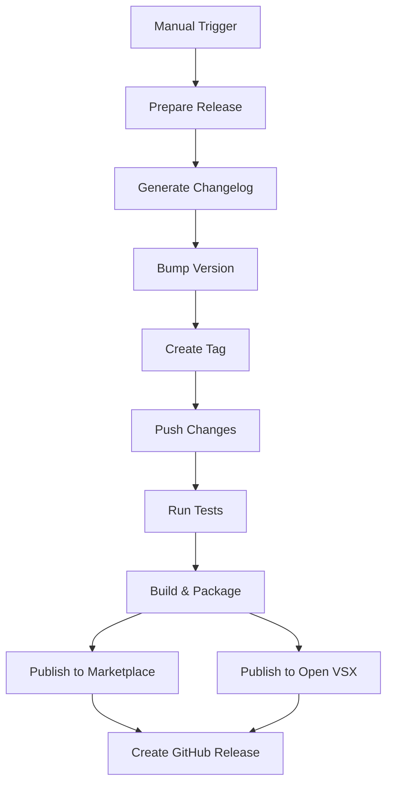

# 🚀 Release Process

## Overview

This project uses an **automated release workflow** that handles:

- ✅ Changelog generation from conventional commits
- ✅ Version bumping (patch/minor/major)
- ✅ Git tagging
- ✅ Publishing to VS Code Marketplace
- ✅ Publishing to Open VSX Registry
- ✅ Creating GitHub Releases

## 📋 Quick Start

### Option 1: GitHub Actions (Recommended) 🎯

**Best for: Interactive, controlled releases**

1. **Go to GitHub Actions:**
   - Visit: <https://github.com/tobiashochguertel/vscode-catalog-lens/actions>
   - Select "Publish Extension" workflow

2. **Click "Run workflow"**

3. **Configure release:**
   - **Version increment:** patch / minor / major
   - **Publish to VS Code Marketplace:** ✅ (default: yes)
   - **Publish to Open VSX:** ✅ (default: yes)
   - **Create GitHub Release:** ✅ (default: yes)
   - **Skip changelog generation:** ❌ (default: no)

4. **Click "Run workflow" to start**

5. **Wait for completion** (~5-10 minutes)
   - ✅ Changelog generated automatically
   - ✅ Version bumped and committed
   - ✅ Tag created
   - ✅ Extension published
   - ✅ GitHub release created with notes

### Option 2: Local Release Script 🖥️

**Best for: Quick local releases**

```bash
# Patch release (0.6.2 → 0.6.3)
./scripts/release.sh patch

# Minor release (0.6.2 → 0.7.0)
./scripts/release.sh minor

# Major release (0.6.2 → 1.0.0)
./scripts/release.sh major
```

**What it does:**

1. ✅ Generates changelog from commits
2. ✅ Bumps version in package.json
3. ✅ Creates git tag
4. ✅ Pushes to remote
5. 📝 Shows next steps for publishing

**Then use GitHub Actions to publish** (Option 1 above)

### Option 3: Manual Release 🔧

**Best for: Full control, troubleshooting**

```bash
# 1. Generate changelog
pnpm changelog
git add CHANGELOG.md
git commit -m "chore: update changelog"

# 2. Bump version
pnpm release  # Uses bumpp - interactive
# or
pnpm release --patch --no-push --no-tag -y  # Non-interactive

# 3. Push changes
git push origin main
git push origin --tags

# 4. Use GitHub Actions to publish (Option 1)
```

---

## 🔄 Workflow Details

### Automated GitHub Workflow

The workflow (`/.github/workflows/publish.yml`) has these stages:



### Stage 1: Prepare Release

**What happens:**

- Checks out repository with full git history
- Generates changelog using `conventional-changelog`
- Commits changelog changes
- Bumps version based on your selection (patch/minor/major)
- Creates git tag (e.g., `v0.6.3`)
- Pushes changes and tag to main branch

**Output:**

- Updated CHANGELOG.md
- Updated package.json version
- New git tag

### Stage 2: Test & Build

**What happens:**

- Runs all tests (unit + integration)
- Type checks TypeScript
- Lints code
- Builds extension
- Packages .vsix file

**Output:**

- Verified code quality
- catalog-lens-X.Y.Z.vsix package

### Stage 3: Publish

**What happens:**

- Publishes to VS Code Marketplace (if enabled)
- Publishes to Open VSX Registry (if enabled)

**Requirements:**

- `VSCE_PAT` secret (VS Code Marketplace token)
- `OVSX_PAT` secret (Open VSX token)

### Stage 4: Create GitHub Release

**What happens:**

- Extracts release notes from CHANGELOG.md
- Creates GitHub release with version tag
- Attaches .vsix file to release

**Output:**

- GitHub release with changelog and downloadable .vsix

---

## 📝 Changelog Generation

### How It Works

The workflow uses **conventional-changelog-cli** with the **Angular preset**:

```bash
pnpm changelog  # Updates CHANGELOG.md
```

**Input:** Git commits following Conventional Commits format
**Output:** Structured CHANGELOG.md with proper h2 headings

### Commit Format Required

```
<type>(<scope>): <description>
```

**Examples:**

```bash
feat(catalog): add Bun workspace support
fix(parser): handle edge case in YAML
docs: update README
chore(deps): upgrade TypeScript
```

### Changelog Structure

```markdown
## [0.6.3](compare-link) (2025-10-13)

### Features

- **catalog:** add new feature ([abc123](commit-link))

### Bug Fixes

- **parser:** fix issue ([def456](commit-link))

### BREAKING CHANGES

- Description of breaking change
```

**✅ Heading Levels:**

- `## [version]` - Version header (h2) ✅ Correct for markdownlint
- `### Type` - Commit type sections (h3)

### Configuration

**File:** `.versionrc.json`

```json
{
  "header": "# Changelog\n\nAll notable changes to this project will be documented in this file.\n",
  "types": [
    { "type": "feat", "section": "Features" },
    { "type": "fix", "section": "Bug Fixes" },
    { "type": "perf", "section": "Performance Improvements" }
  ]
}
```

**What's included in CHANGELOG:**

- ✅ feat (Features)
- ✅ fix (Bug Fixes)
- ✅ perf (Performance Improvements)
- ✅ revert (Reverts)
- ❌ docs, style, refactor, test, build, ci, chore (hidden)

---

## 🎛️ GitHub Actions Inputs

When triggering the workflow manually, you can configure:

### version_increment (required)

**Options:**

- `patch` - Increment patch version (0.6.2 → 0.6.3)
- `minor` - Increment minor version (0.6.2 → 0.7.0)
- `major` - Increment major version (0.6.2 → 1.0.0)

**Default:** `patch`

### publish_marketplace (optional)

Publish to VS Code Marketplace?

**Default:** `true`

### publish_openvsx (optional)

Publish to Open VSX Registry?

**Default:** `true`

### create_release (optional)

Create GitHub Release with changelog?

**Default:** `true`

### skip_changelog (optional)

Skip automatic changelog generation? (Use if you manually updated CHANGELOG.md)

**Default:** `false`

---

## 🔐 Required Secrets

Configure these in GitHub repository settings:

### VSCE_PAT

**Purpose:** Publish to VS Code Marketplace

**How to create:**

1. Go to <https://dev.azure.com>
2. Create Personal Access Token
3. Grant "Marketplace" permission
4. Copy token
5. Add to GitHub: Settings → Secrets → New repository secret

### OVSX_PAT

**Purpose:** Publish to Open VSX Registry

**How to create:**

1. Go to <https://open-vsx.org>
2. Generate Access Token
3. Copy token
4. Add to GitHub: Settings → Secrets → New repository secret

### GITHUB_TOKEN

**Purpose:** Create GitHub releases, push commits/tags

**Note:** Automatically provided by GitHub Actions (no setup needed)

---

## 📊 Version Numbering

We follow **Semantic Versioning** (SemVer):

```
MAJOR.MINOR.PATCH
  |     |     |
  |     |     └─ Bug fixes, small changes (0.6.2 → 0.6.3)
  |     └─────── New features, backwards compatible (0.6.2 → 0.7.0)
  └───────────── Breaking changes (0.6.2 → 1.0.0)
```

### When to Use Each Type

**Patch (0.6.2 → 0.6.3):**

- Bug fixes
- Documentation updates
- Performance improvements
- Refactoring without behavior changes

**Minor (0.6.2 → 0.7.0):**

- New features
- New functionality
- Backwards-compatible API additions

**Major (0.6.2 → 1.0.0):**

- Breaking changes
- Incompatible API changes
- Major architecture changes

---

## 🧪 Testing Before Release

Before triggering a release, ensure:

```bash
# Run full check suite
pnpm check

# Or run individual checks
pnpm format:check  # Prettier
pnpm markdown:lint # Markdown linting
pnpm lint          # ESLint
pnpm typecheck     # TypeScript
pnpm build         # Build extension
pnpm test:unit     # Unit tests
```

**CI will run these automatically**, but running locally saves time.

---

## 🐛 Troubleshooting

### Changelog not updated

**Cause:** No conventional commits since last release

**Solution:**

- Check commits: `git log --oneline $(git describe --tags --abbrev=0)..HEAD`
- Ensure commits follow format: `feat:`, `fix:`, etc.
- Or manually update CHANGELOG.md and skip changelog generation

### Version bump failed

**Cause:** Uncommitted changes or conflicts

**Solution:**

```bash
git status           # Check for uncommitted changes
git stash            # Stash changes if needed
./scripts/release.sh # Try again
```

### Publish failed - Authentication error

**Cause:** Missing or invalid PAT tokens

**Solution:**

1. Check GitHub secrets are configured
2. Verify PAT tokens are still valid
3. Regenerate tokens if expired

### Workflow didn't run

**Cause:** Permissions or branch protection

**Solution:**

1. Check workflow file syntax
2. Verify GitHub Actions are enabled
3. Check branch protection rules

---

## 📚 Related Documentation

- [CHANGELOG_SETUP.md](../CHANGELOG_SETUP.md) - Changelog system documentation
- [CHANGELOG_QUICKSTART.md](../CHANGELOG_QUICKSTART.md) - Quick reference
- [Conventional Commits](https://www.conventionalcommits.org/) - Commit message format
- [Semantic Versioning](https://semver.org/) - Version numbering

---

## ✅ Release Checklist

Before releasing:

- [ ] All tests passing locally
- [ ] CHANGELOG.md reviewed (if manually edited)
- [ ] Commits follow Conventional Commits format
- [ ] No uncommitted changes
- [ ] GitHub secrets configured (VSCE_PAT, OVSX_PAT)
- [ ] Version increment selected (patch/minor/major)

After releasing:

- [ ] Verify GitHub release created
- [ ] Verify VS Code Marketplace updated
- [ ] Verify Open VSX updated
- [ ] Test installation: `code --install-extension catalog-lens-X.Y.Z.vsix`
- [ ] Announce release (Twitter, Discord, etc.)

---

**Questions?** Check [CHANGELOG_SETUP.md](../CHANGELOG_SETUP.md) or open an issue.
