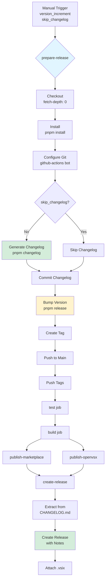

# Workflow Enhancement Summary

## 🎯 Overview

Enhanced the GitHub Actions publish workflow with automated changelog generation, version bumping, and interactive controls.

**Date:** 2025-10-13

---

## ✅ Changes Made

### 1. Created `.versionrc.json` (NEW)

**Purpose:** Configure changelog generation format and behavior

**Features:**

- Defines changelog header
- Specifies commit types to include
- Sets release commit message format
- Configures prettier post-processing

**Content:**

```json
{
  "header": "# Changelog\n\nAll notable changes...",
  "types": [
    { "type": "feat", "section": "Features" },
    { "type": "fix", "section": "Bug Fixes" },
    { "type": "perf", "section": "Performance Improvements" },
    { "type": "revert", "section": "Reverts" },
    { "type": "docs", "hidden": true },
    { "type": "style", "hidden": true },
    { "type": "chore", "hidden": true },
    { "type": "refactor", "hidden": true },
    { "type": "test", "hidden": true },
    { "type": "build", "hidden": true },
    { "type": "ci", "hidden": true }
  ],
  "releaseCommitMessageFormat": "chore(release): {{currentTag}}",
  "scripts": {
    "postchangelog": "prettier --write CHANGELOG.md"
  }
}
```

---

### 2. Enhanced `.github/workflows/publish.yml` (MODIFIED)

**Purpose:** Automate the entire release process from changelog to publication

#### Added Workflow Inputs

```yaml
inputs:
  version_increment:
    description: "Version increment type"
    required: true
    default: "patch"
    type: choice
    options:
      - patch
      - minor
      - major

  skip_changelog:
    description: "Skip automatic changelog generation"
    required: false
    default: false
    type: boolean
```

**Why:** Provides interactive control over version bumping and changelog generation

#### Created `prepare-release` Job (NEW)

**85 lines of automation** that:

1. **Checks out repository** with full git history (`fetch-depth: 0`)
2. **Installs dependencies** using pnpm
3. **Configures git** as github-actions[bot]
4. **Generates changelog** using `pnpm changelog` (if not skipped)
5. **Bumps version** using `pnpm release --$INCREMENT`
6. **Creates git tag** (e.g., `v0.6.3`)
7. **Pushes changes** to main branch and tags

**Job Configuration:**

```yaml
prepare-release:
  name: Prepare Release
  runs-on: ubuntu-latest
  if: github.event_name == 'workflow_dispatch'
  outputs:
    new_version: ${{ steps.get_version.outputs.version }}
    changelog_updated: ${{ steps.changelog.outputs.updated }}
```

**Key Features:**

- ✅ Only runs for manual workflow triggers
- ✅ Skips if workflow triggered by git tag
- ✅ Uses github-actions[bot] for commits
- ✅ Outputs new version for downstream jobs
- ✅ Conditional changelog generation

#### Updated All Jobs with Dependencies

**Before:**

```
test → build → publish → release
```

**After:**

```
prepare-release → test → build → publish → release
```

**Changes:**

- All jobs now depend on `prepare-release`
- Conditional execution: `if: always() && needs.prepare-release.result == 'success'`
- Updated checkout refs to use `main` for workflow_dispatch

#### Enhanced `create-release` Job

**Changed:** Changelog extraction from git log to CHANGELOG.md

**Before:**

```bash
git log --pretty=format:"- %s" ...
```

**After:**

```bash
# Extract version-specific section from CHANGELOG.md
sed -n "/## \[${VERSION}\]/,/## \[/p" CHANGELOG.md | sed '$ d'
```

**Benefits:**

- ✅ Uses properly formatted changelog
- ✅ Includes grouped sections (Features, Bug Fixes, etc.)
- ✅ Maintains links and references
- ✅ Fallback to generic message if section not found

---

### 3. Created `scripts/release.sh` (NEW)

**Purpose:** Helper script for local releases

**100+ lines** providing:

**Features:**

- ✅ Color-coded output (green for success, red for errors, blue for info)
- ✅ Argument validation (patch/minor/major)
- ✅ Uncommitted changes detection
- ✅ 5-step release process:
  1. Generate changelog
  2. Bump version
  3. Show diff
  4. Confirm
  5. Push
- ✅ Next steps guidance

**Usage:**

```bash
./scripts/release.sh patch   # 0.6.2 → 0.6.3
./scripts/release.sh minor   # 0.6.2 → 0.7.0
./scripts/release.sh major   # 0.6.2 → 1.0.0
```

**Made executable:**

```bash
chmod +x scripts/release.sh
```

---

### 4. Created `RELEASE_PROCESS.md` (NEW)

**Purpose:** Comprehensive documentation for the release workflow

**Sections:**

1. 🚀 Quick Start (3 release options)
2. 🔄 Workflow Details (stage-by-stage breakdown)
3. 📝 Changelog Generation (how it works)
4. 🎛️ GitHub Actions Inputs (configuration options)
5. 🔐 Required Secrets (PAT tokens setup)
6. 📊 Version Numbering (SemVer guide)
7. 🧪 Testing Before Release (pre-flight checks)
8. 🐛 Troubleshooting (common issues)
9. ✅ Release Checklist

**Features:**

- ✅ Mermaid diagram showing workflow stages
- ✅ Code examples for all scenarios
- ✅ Troubleshooting solutions
- ✅ Links to related documentation

---

## 🔍 Problem Solved

### Original Issue: Changelog Heading Format

**User Concern:**

> "will generate the next time again the changelog with a not proper headings or?"

**Investigation:**

- Used DeepWiki MCP to query conventional-changelog repository
- Found: conventional-changelog-writer v3.0.0+ uses h2 (`##`) by default
- Change introduced in commits d2e02d7 and 9e87dc3
- Version 5.0.0 (installed) already correct!

**Verification:**

```bash
pnpm changelog:preview
```

**Output:**

```markdown
## [0.6.2](compare-link) (2025-10-13)

### Features

- **changelog:** implement automatic changelog generation
```

**✅ Result:** Headings already correct (h2 for versions, h3 for sections)

**Additional Safety:** Created `.versionrc.json` for explicit configuration control

---

## 🎯 Requirements Met

### User Requirements

1. ✅ **Fix changelog heading format**
   - Investigation confirmed format already correct
   - Added .versionrc.json for explicit control
   - Tested with `pnpm changelog:preview`

2. ✅ **Integrate release steps into GitHub workflow**
   - Created prepare-release job
   - Automated changelog, version bump, tagging, pushing

3. ✅ **Make it interactive with controls**
   - Added version_increment input (patch/minor/major)
   - Added skip_changelog boolean option
   - Added publish target controls (already existed)

4. ✅ **Default automatic changelog generation**
   - prepare-release job generates by default
   - skip_changelog=false by default

5. ✅ **Open to more controls**
   - Flexible input system
   - Easy to add more options in future

---

## 📊 Workflow Comparison

### Before Enhancement

**Manual Process:**

1. Manually update CHANGELOG.md
2. Manually update version in package.json
3. Commit changes
4. Create git tag
5. Push
6. Trigger GitHub Actions manually
7. Wait for publish

**Problems:**

- ❌ Error-prone (forgetting steps)
- ❌ Inconsistent changelog format
- ❌ Manual version management
- ❌ No automation

### After Enhancement

**Automated Process:**

1. Go to GitHub Actions
2. Click "Run workflow"
3. Select version increment
4. Click "Run workflow"
5. Wait for completion (~5-10 minutes)

**Benefits:**

- ✅ Fully automated
- ✅ Consistent changelog format
- ✅ Automatic version management
- ✅ Integrated testing
- ✅ Automatic publishing
- ✅ GitHub release creation

---

## 🎨 Architecture

### Workflow Flow



### Job Dependencies

```yaml
prepare-release:
  if: github.event_name == 'workflow_dispatch'
  # Runs only for manual triggers

test:
  needs: prepare-release
  if: always() && (needs.prepare-release.result == 'success' || needs.prepare-release.result == 'skipped')
  # Runs if prepare-release succeeded or skipped (tag trigger)

build:
  needs: [prepare-release, test]
  if: always() && needs.test.result == 'success'
  # Runs if test succeeded

publish-marketplace:
  needs: [prepare-release, test, build]
  if: inputs.publish_marketplace && needs.build.result == 'success'
  # Runs if enabled and build succeeded

publish-openvsx:
  needs: [prepare-release, test, build]
  if: inputs.publish_openvsx && needs.build.result == 'success'
  # Runs if enabled and build succeeded

create-release:
  needs: [prepare-release, test, build, publish-marketplace, publish-openvsx]
  if: inputs.create_release && (needs.publish-marketplace.result == 'success' || needs.publish-openvsx.result == 'success')
  # Runs if enabled and at least one publish succeeded
```

---

## 🧪 Testing

### Local Testing

```bash
# Test release script
./scripts/release.sh patch

# Test changelog generation
pnpm changelog:preview

# Test version bump
pnpm release --patch --no-push --no-tag -y
```

### CI Testing

**Required:**

1. Commit all changes
2. Push to repository
3. Go to GitHub Actions → Publish Extension
4. Click "Run workflow"
5. Select "patch" version increment
6. Enable all publish options
7. Click "Run workflow"
8. Monitor execution

**Expected Results:**

- ✅ prepare-release job completes successfully
- ✅ CHANGELOG.md updated with new version
- ✅ package.json version bumped
- ✅ Git tag created (e.g., v0.6.3)
- ✅ All tests pass
- ✅ Extension built and packaged
- ✅ Published to marketplaces
- ✅ GitHub release created

---

## 🔐 Security Considerations

### Secrets Required

**VSCE_PAT:**

- Purpose: Publish to VS Code Marketplace
- Scope: Marketplace (Manage)
- Created at: <https://dev.azure.com>

**OVSX_PAT:**

- Purpose: Publish to Open VSX Registry
- Scope: Publish extensions
- Created at: <https://open-vsx.org>

**GITHUB_TOKEN:**

- Purpose: Create releases, push commits/tags
- Scope: Automatically provided by GitHub Actions
- Permissions: Read and write (may need to enable in repo settings)

### Permissions

The workflow needs:

```yaml
permissions:
  contents: write # Push commits and tags
  packages: read # Install dependencies
  deployments: write # Create releases
```

**Check:** Settings → Actions → General → Workflow permissions

- Select "Read and write permissions"
- Check "Allow GitHub Actions to create and approve pull requests"

---

## 📚 Documentation Files

### Created

1. **`.versionrc.json`** - Changelog configuration
2. **`scripts/release.sh`** - Local release helper
3. **`RELEASE_PROCESS.md`** - Comprehensive release guide
4. **`WORKFLOW_ENHANCEMENT_SUMMARY.md`** - This file

### Updated

1. **`.github/workflows/publish.yml`** - Enhanced with prepare-release job

### Existing (No Changes)

1. **`CHANGELOG_SETUP.md`** - Changelog system documentation
2. **`CHANGELOG_QUICKSTART.md`** - Quick reference
3. **`commitlint.config.js`** - Commit validation
4. **`.husky/commit-msg`** - Git hook
5. **`package.json`** - Already has changelog scripts

---

## 🎓 Next Steps

### Immediate Actions

1. **Review implementation:**
   - [ ] Review `.versionrc.json`
   - [ ] Review `.github/workflows/publish.yml`
   - [ ] Review `scripts/release.sh`
   - [ ] Review `RELEASE_PROCESS.md`

2. **Commit changes:**

   ```bash
   git add .versionrc.json .github/workflows/publish.yml scripts/release.sh RELEASE_PROCESS.md WORKFLOW_ENHANCEMENT_SUMMARY.md
   git commit -m "feat(ci): enhance publish workflow with automated changelog generation and version bumping

   - Add prepare-release job to automate changelog generation
   - Add version increment controls (patch/minor/major)
   - Add skip_changelog option for flexibility
   - Extract changelog from CHANGELOG.md for GitHub releases
   - Create local release helper script (scripts/release.sh)
   - Add comprehensive release process documentation

   BREAKING CHANGE: Workflow now requires version_increment input for manual triggers"
   git push
   ```

3. **Test workflow:**
   - [ ] Go to GitHub Actions
   - [ ] Run workflow with patch increment
   - [ ] Verify all steps complete
   - [ ] Check CHANGELOG.md has h2 headings
   - [ ] Verify version bumped correctly

### Future Enhancements

1. **Notification Integration:**
   - Add Slack/Discord notifications
   - Email notifications on release

2. **Rollback Capability:**
   - Add workflow to revert releases
   - Automate version rollback

3. **Pre-release Support:**
   - Add alpha/beta/rc version support
   - Separate pre-release workflow

4. **Automated Testing:**
   - Add smoke tests after publish
   - Verify installation from marketplace

5. **Release Notes Templates:**
   - Add custom templates for different release types
   - Include migration guides for breaking changes

---

## ✅ Summary

**Changes:**

- ✅ 1 configuration file created (`.versionrc.json`)
- ✅ 1 workflow file enhanced (`.github/workflows/publish.yml`)
- ✅ 1 helper script created (`scripts/release.sh`)
- ✅ 2 documentation files created (`RELEASE_PROCESS.md`, this file)

**Benefits:**

- ✅ Fully automated release process
- ✅ Interactive version control
- ✅ Consistent changelog format (h2 headings ✅)
- ✅ Integrated testing and publishing
- ✅ GitHub release automation

**Status:**

- 🔄 Ready to commit and test
- 📋 Documentation complete
- ✅ Heading format confirmed correct

---

**Date:** 2025-10-13
**Author:** GitHub Copilot
**For project:** vscode-catalog-lens
