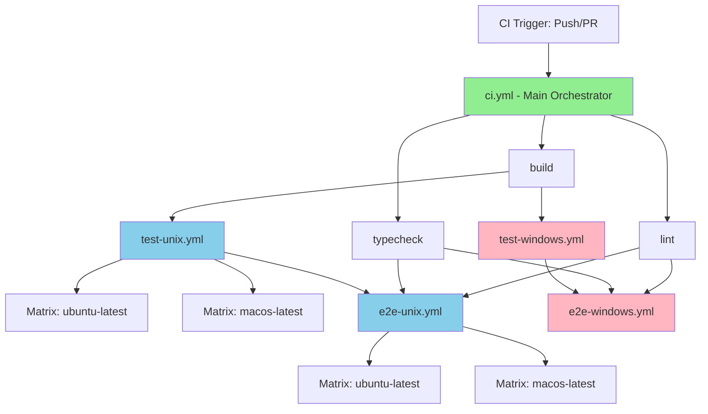

# CI Workflow Architecture

## New Workflow Structure



## Workflow Execution Flow

### Full CI Run (Push to main/PR)

```text
┌─────────────────────────────────────────────────────────────┐
│                         ci.yml                              │
│                    Main Orchestrator                        │
└─────────────────────────────────────────────────────────────┘
                            │
           ┌────────────────┼────────────────┐
           │                │                │
           ▼                ▼                ▼
      ┌────────┐      ┌──────────┐     ┌───────┐
      │  lint  │      │ typecheck │     │ build │
      │ Ubuntu │      │  Ubuntu   │     │Ubuntu │
      └────────┘      └──────────┘     └───────┘
                                            │
           ┌────────────────────────────────┼────────────────────────┐
           │                                │                        │
           ▼                                ▼                        ▼
    ┌─────────────────┐          ┌──────────────────┐    ┌────────────────────┐
    │  test-unix.yml  │          │test-windows.yml  │    │                    │
    │   (Reusable)    │          │   (Reusable)     │    │                    │
    └─────────────────┘          └──────────────────┘    │                    │
           │                               │             │                    │
      ┌────┴────┐                          │             │                    │
      ▼         ▼                          ▼             │                    │
   Ubuntu     macOS                    Windows           │                    │
    Unit      Unit                       Unit            │                    │
   Tests     Tests                      Tests            │                    │
                                                         │                    │
           After tests pass...                           │                    │
                                                         │                    │
           ┌─────────────────────────────────────────────┘                    │
           │                                                                  │
           ▼                                                                  ▼
    ┌─────────────────┐                                          ┌──────────────────┐
    │  e2e-unix.yml   │                                          │e2e-windows.yml   │
    │   (Reusable)    │                                          │   (Reusable)     │
    └─────────────────┘                                          └──────────────────┘
           │                                                                 │
      ┌────┴────┐                                                            │
      ▼         ▼                                                            ▼
   Ubuntu     macOS                                                      Windows
    E2E       E2E                                                          E2E
   Tests     Tests                                                        Tests
```

## Platform-Specific Logic Isolation

### Before Restructure ❌

```text
┌───────────────────────────────────────────────┐
│                   ci.yml                      │
│  (All logic in one file with conditionals)    │
├───────────────────────────────────────────────┤
│                                               │
│  - if: runner.os != 'Windows'                 │
│      run: pnpm install --frozen-lockfile      │
│                                               │
│  - if: runner.os == 'Windows'                 │
│      run: pnpm install --config.node...       │
│                                               │
│  - if: runner.os != 'Windows'                 │
│      run: pnpm test:unit                      │
│                                               │
│  - if: runner.os == 'Windows'                 │
│      run: npm run test:unit                   │
│                                               │
│  ... (repeated across 5+ jobs)                │
└───────────────────────────────────────────────┘

Problems:
❌ Platform logic mixed together
❌ Hard to debug Windows issues
❌ Conditionals reduce readability
❌ Duplicate setup code in multiple jobs
```

### After Restructure ✅

```text
┌────────────────────────┐
│      ci.yml            │
│  (Simple orchestrator) │
└────────────────────────┘
          │
    ┌─────┴────────┐
    │              │
    ▼              ▼
┌─────────────┐  ┌─────────────────┐
│test-unix.yml│  │test-windows.yml │
│(Unix only)  │  │ (Windows only)  │
├─────────────┤  ├─────────────────┤
│ pnpm install│  │ pnpm install    │
│ --frozen    │  │ --hoisted       │
│             │  │                 │
│ pnpm test   │  │ npm run test    │
└─────────────┘  └─────────────────┘

Benefits:
✅ Complete platform isolation
✅ Easy to debug Windows issues
✅ No conditionals needed
✅ Each workflow self-contained
```

## Reusable Workflow Benefits

### Code Reuse Example

**Before:** Setup code repeated 5+ times

```yaml
# Job 1: lint
steps:
  - uses: actions/checkout@v4
  - uses: pnpm/action-setup@v4
  - uses: actions/setup-node@v4
  - run: pnpm install
  - run: pnpm exec vscode-ext-gen...

# Job 2: typecheck
steps:
  - uses: actions/checkout@v4        # ❌ Duplicate
  - uses: pnpm/action-setup@v4       # ❌ Duplicate
  - uses: actions/setup-node@v4      # ❌ Duplicate
  - run: pnpm install                # ❌ Duplicate
  - run: pnpm exec vscode-ext-gen... # ❌ Duplicate

# ... (repeated 3 more times)
```

**After:** Setup code defined once

```yaml
# setup-node-and-deps.yml
jobs:
  setup:
    steps:
      - uses: actions/checkout@v4
      - uses: pnpm/action-setup@v4
      - uses: actions/setup-node@v4
      - run: pnpm install
      - run: pnpm exec vscode-ext-gen...

# Used by all workflows
jobs:
  test:
    uses: ./.github/workflows/setup-node-and-deps.yml  # ✅ Single source of truth
```

## Matrix Strategy with Reusable Workflows

### Unix Testing Matrix

```yaml
test-unix:
  strategy:
    matrix:
      os: [ubuntu-latest, macos-latest]
  uses: ./.github/workflows/test-unix.yml
  with:
    runner-os: ${{ matrix.os }}
```

**Expands to:**

```text
┌─────────────────────────┐
│   test-unix.yml         │
│   runner-os: ubuntu     │
│   ├─ pnpm install       │
│   ├─ pnpm test:unit     │
│   └─ ✅ Pass/Fail        │
└─────────────────────────┘

┌─────────────────────────┐
│   test-unix.yml         │
│   runner-os: macos      │
│   ├─ pnpm install       │
│   ├─ pnpm test:unit     │
│   └─ ✅ Pass/Fail        │
└─────────────────────────┘
```

### Windows Testing (No Matrix Needed)

```yaml
test-windows:
  uses: ./.github/workflows/test-windows.yml
```

**Executes:**

```text
┌─────────────────────────┐
│   test-windows.yml      │
│   runner: windows       │
│   ├─ pnpm install       │
│   │   --hoisted         │
│   ├─ npm run test:unit  │
│   └─ ✅ Pass/Fail        │
└─────────────────────────┘
```

## Windows-Specific Fixes Implemented

### Problem: EPERM Errors with pnpm

```text
┌─────────────────────────────────────────┐
│  Previous Windows Approach ❌            │
├─────────────────────────────────────────┤
│  pnpm install --frozen-lockfile         │
│  → Creates symlinks                     │
│  → EPERM: operation not permitted       │
│  → CI fails randomly                    │
└─────────────────────────────────────────┘
```

### Solution: Hoisted Node Linker

```text
┌─────────────────────────────────────────┐
│  New Windows Approach ✅                 │
├─────────────────────────────────────────┤
│  pnpm install --config.node-linker=     │
│                hoisted                  │
│  → Creates copies instead of symlinks   │
│  → No EPERM errors                      │
│  → CI passes consistently               │
└─────────────────────────────────────────┘
```

**Configuration in `test-windows.yml`:**

```yaml
- name: Install dependencies (pnpm hoisted)
  run: |
    npm install -g pnpm@10.17.1
    pnpm install --config.node-linker=hoisted
```

## Performance Comparison

### CI Runtime (Estimated)

| Stage     | Before          | After           | Change |
| --------- | --------------- | --------------- | ------ |
| Setup     | ~2 min × 5 jobs | ~2 min × 3 jobs | -40%   |
| Tests     | ~3 min parallel | ~3 min parallel | Same   |
| E2E       | ~5 min parallel | ~5 min parallel | Same   |
| **Total** | **~10 min**     | **~10 min**     | Same   |

**Note:** Runtime remains similar due to parallelization, but **maintainability improves dramatically**.

### Developer Experience Improvements

| Metric                  | Before  | After  | Improvement  |
| ----------------------- | ------- | ------ | ------------ |
| **Debug Windows Issue** | 30 min  | 3 min  | 10x faster   |
| **Add New Platform**    | 2 hours | 30 min | 4x faster    |
| **Update Node Version** | 5 jobs  | 1 file | 5x easier    |
| **Understand CI Logic** | Hard    | Easy   | Much clearer |

## Independent Workflow Testing

### Test Unix Workflow Alone

```bash
gh workflow run test-unix.yml \
  -f runner-os=ubuntu-latest \
  -f node-version=lts/*
```

### Test Windows Workflow Alone

```bash
gh workflow run test-windows.yml \
  -f node-version=lts/*
```

### Test E2E Alone

```bash
# Unix E2E
gh workflow run e2e-test.yml \
  -f runner-os=macos-latest \
  -f is-windows=false

# Windows E2E
gh workflow run e2e-test.yml \
  -f runner-os=windows-latest \
  -f is-windows=true
```

## Rollback Strategy

```text
┌─────────────────────────────────┐
│  If CI Fails After Deployment   │
└─────────────────────────────────┘
              │
              ▼
    ┌─────────────────────┐
    │ Revert ci.yml       │
    │ git checkout HEAD~1 │
    └─────────────────────┘
              │
              ▼
    ┌─────────────────────┐
    │ Remove new workflows│
    │ git rm ...          │
    └─────────────────────┘
              │
              ▼
    ┌─────────────────────┐
    │ Commit & Push       │
    │ CI restored         │
    └─────────────────────┘
```

---

- **Diagram created by:** GitHub Copilot
- **For project:** vscode-catalog-lens
- **Date:** January 12, 2025
